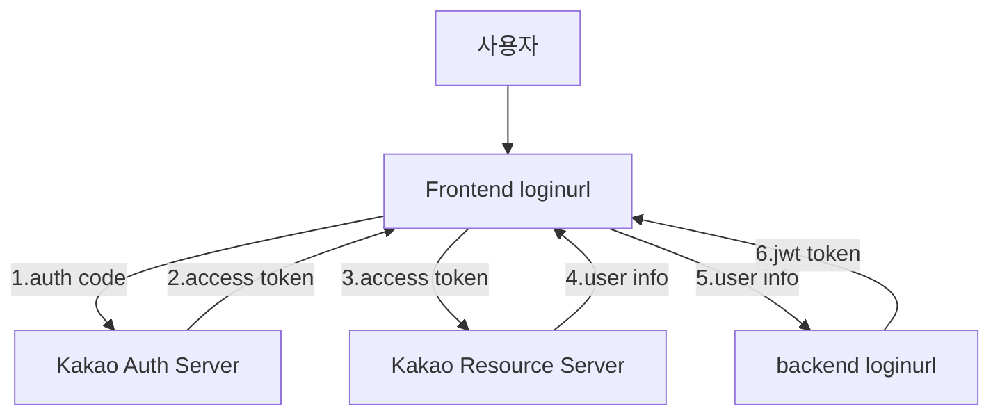

# ⚙️세부 기술스택
* Springboot 3.1.2
  * Spring Web
  * Spring Data Jpa
  * Spring Security
  * Spring Cache
  * Spring Cloud-openfeign
* DB/Cache
  * H2 DB
  * CaffeineCache(내장 캐시 용도) 3.1.1
* 기타 유틸
  * Swagger(springdoc 2.2.0)
  * Opencsv 5.5
  * jjwt(jwt 관련) 0.11.5

 

# 👉로그인 Flow

 

# 👉ERD

